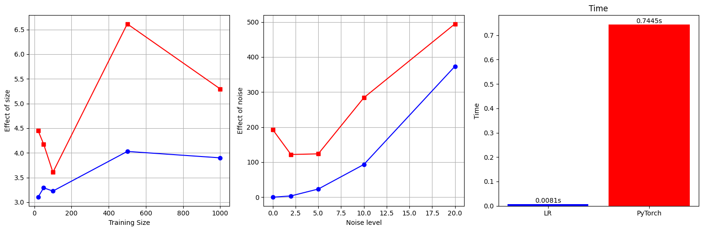

# Comparative Analysis: Multilayer Perceptron (MLP) vs. Linear Regression 📊

### 🔬 Project Overview
This project performs a stress-test comparison between a **Linear Regression** model (Baseline) and a **Multilayer Perceptron** (Deep Learning) on synthetic linear datasets.

The goal is to analyze the trade-offs between model complexity, computational efficiency, and robustness when dealing with simple linear relationships.

### 🧪 Experiment Setup
We conducted 3 controlled experiments using Python (`PyTorch` & `Scikit-learn`):
1.  **Data Size Impact:** Varying training samples from 20 to 1000.
2.  **Noise Robustness:** Increasing Gaussian noise levels from 0 to 20.
3.  **Efficiency:** Measuring training time on a dataset of 10,000 samples.

### 📈 Key Findings (Results)

*(Please upload your chart image to the repo and ensure the filename matches)*

1.  **Instability of MLP:** On small datasets ($N < 50$), the Neural Network showed high variance and instability compared to the consistent baseline of Linear Regression.
2.  **Overfitting to Noise:** As shown in the middle chart, while Linear Regression remained robust, the MLP tended to overfit the noise, leading to significantly higher MSE loss.
3.  **Computational Cost:** The MLP took **~0.6s** to train, while Linear Regression took only **~0.004s** (approx. 150x faster) for the same task.

### 💡 Conclusion
While Neural Networks are powerful, they are not a "silver bullet." For linear problems, simple algorithms like Linear Regression are far superior in terms of:
* **Stability** (Reproducible results)
* **Efficiency** (Time & Compute)
* **Robustness** (Resistance to noise)

### 🛠️ Technologies Used
* **Language:** Python 3.x
* **Libraries:** `PyTorch`, `Scikit-learn`, `NumPy`, `Matplotlib`

---
**Author:** [Điền Tên Bạn Vào Đây]
**Date:** November 2025
